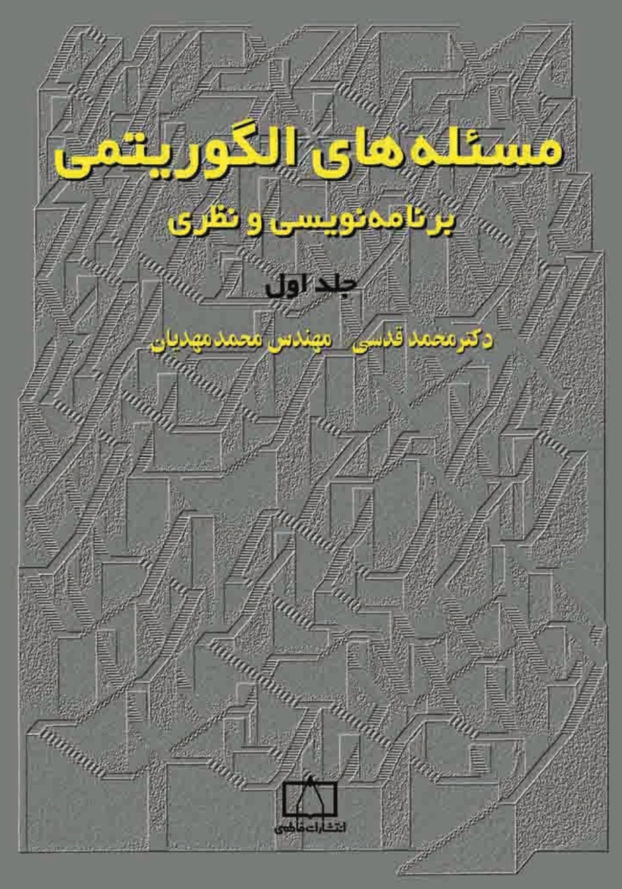

# Algorithmic problems

"Algorithmic problems" is a book written by Prof. M. Ghodsi from Sharif university of technology. It contains about 171 algorithmic problems taken from the International Olympiad Of Informatics (IOI). As it said on the book's cover, solving these problems is very recommended for the students who want to prepare themselves for IOI, their teachers, and those studying computer engineering and computer science in universities.

I decided to start solving all 171 book challenges and share my solutions with other enthusiasts. All problems are prepared in a single Jupyter notebook, and the problem statement and the answers are also available in the notebook.
